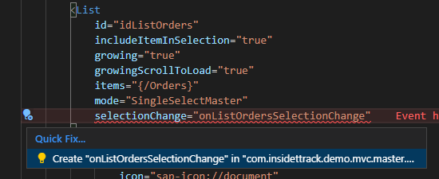
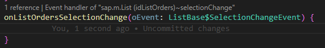

## 1.12.1 (10-07-2023)

-   `README.md` updated

## 1.12.0 (09-07-2023)

-   New command added: `ui5plugin.bulkExportToi18n` [Readme](README.md#export-to-i18n-bulk)
-   New preference entry added: `ui5.plugin.bulkExportToi18nCommandData`

## 1.11.1 (05-07-2023)

-   XML attribute completion items now are filtered by usage. If attribute already exists, no completion item will be shown for it.

## 1.11.0 (03-07-2023)

-   [UI5 Linter](https://github.com/iljapostnovs/ui5plugin-linter) updated to v1.8.1
-   `TagAttributeDefaultValueLinter` configuration entry added. [Readme](https://github.com/iljapostnovs/ui5plugin-linter/blob/master/README.md#tagattributedefaultvaluelinter)
-   `EventTypeLinter` added. [Readme](https://github.com/iljapostnovs/ui5plugin-linter/blob/master/README.md#eventtypelinter-ts-only-11151)
-   New command introduced: [ui5plugin.generateIds](README.md#generate-ids-for-all-elements-in-view-or-fragment).
-   New preference entries introduced: `ui5.plugin.idGenerationFormula`, `ui5.plugin.generateIdsCommandData` ([Configuration Readme](README.md#configuration))
-   XML Formatter no longer replaces double backslash with single backslash

## 1.10.1 (28-06-2023)

-   `sap/ui/base/Event` is not automatically imported anymore if `tsEvent` variable is added to `ui5.plugin.tsEventType` preference entry

## 1.10.0 (27-06-2023)

-   `tsEvent` variable added to `ui5.plugin.tsEventType` preference entry. Handy if UI5 Version `1.115.1`+ is used, because the preference entry can be changed to `{tsEvent}`, and then the necessary event will be added automatically. Comes as a replacement for `tsEvent` variable. (Check [UI5 Type Definitions release notes](https://sap.github.io/ui5-typescript/releasenotes.html))
-   [UI5 Project Data](README.md#ui5-project-data) view added
-   [UI5 Parser](https://github.com/iljapostnovs/ui5plugin-parser) updated to v1.5.6
-   [UI5 Linter](https://github.com/iljapostnovs/ui5plugin-linter) updated to v1.7.6

## 1.9.1 (23-06-2023)

-   [UI5 Parser](https://github.com/iljapostnovs/ui5plugin-parser) updated to v1.5.5
-   [UI5 Linter](https://github.com/iljapostnovs/ui5plugin-linter) updated to v1.7.5

## 1.9.0 (19-06-2023)

-   `tsEventParameters` variable added to `ui5.plugin.tsEventType` preference entry. Handy if UI5 Version `1.115.0`+ is used, because the preference entry can be changed to `Event<{tsEventParameters}>`, and then the necessary generic for event parameters will be added automatically.
    > Example: `Event<$ListBaseSelectionChangeEventParameters>` will be generated, if `Create method` action will be selected on non existant event handler in XML view `sap.m.List` -> `selectionChange` event
    >  > 
-   Typescript version updated to 5.1.3
-   [UI5 Parser](https://github.com/iljapostnovs/ui5plugin-parser) updated to v1.5.4
-   [UI5 Linter](https://github.com/iljapostnovs/ui5plugin-linter) updated to v1.7.4

## 1.8.2 (14-06-2023)

-   Migrate `rc` file handler back to `rc-config-loader` to webpack compatible version

## 1.8.1 (13-06-2023)

-   Migrate `rc` file handler to `cosmiconfig`

## 1.8.0 (12-06-2023)

-   [UI5 Parser](https://github.com/iljapostnovs/ui5plugin-parser) updated to v1.5.1
-   [UI5 Linter](https://github.com/iljapostnovs/ui5plugin-linter) updated to v1.7.1
-   Add `rc` file support

## 1.7.2 (06-06-2023)

-   [UI5 Linter](https://github.com/iljapostnovs/ui5plugin-linter) updated to v1.6.4
-   Bugfix for empty id pattern

## 1.7.1 (02-06-2023)

-   Fix package JSON schema

## 1.7.0 (02-06-2023)

-   [UI5 Parser](https://github.com/iljapostnovs/ui5plugin-parser) updated to v1.4.6
-   [UI5 Linter](https://github.com/iljapostnovs/ui5plugin-linter) updated to v1.6.2
-   XML attribute linter enhanced with `id` and `event handler` naming style check
-   `ui5ignore-patterns` in XML files added for ignoring naming style errors
-   `ui5ignore` in XML files now supports specific attribute ignoring

## 1.6.1 (25-05-2023)

-   [UI5 Parser](https://github.com/iljapostnovs/ui5plugin-parser) updated to v1.4.4
-   Bugfix for links in hover providers

## 1.6.0 (16-05-2023)

-   [UI5 Parser](https://github.com/iljapostnovs/ui5plugin-parser) updated to v1.4.3
-   [UI5 Linter](https://github.com/iljapostnovs/ui5plugin-linter) updated to v1.5.2
-   Bugfix for linter not taking into account `jsClassesToExclude` for TS projects
-   `propertiesLinterExceptions` added to `ui5linter` configuration
-   `@ui5ignore` is now supported in `i18n.properties`

## 1.5.1 (12-05-2023)

-   Fix XML completion items prefilled with "sc" ([#326](https://github.com/iljapostnovs/VSCodeUI5Plugin/issues/326))

## 1.5.0 (10-05-2023)

-   JS Reference CodeLens now shows references for class fields as well
-   Export to i18n command now export either full string if there is no selection, or only selected part of the string

## 1.4.0 (09-05-2023)

-   Fixed rename provider for TS
-   Now `.properties` file has reference CodeLens
-   New preference entry: `ui5.plugin.propertiesCodeLens`
-   Parsing of `.properties` file migrated to [properties-file](https://github.com/Avansai/properties-file) package ([#322](https://github.com/iljapostnovs/VSCodeUI5Plugin/issues/322))
-   [UI5 Parser](https://github.com/iljapostnovs/ui5plugin-parser) updated to v1.4.0
-   [UI5 Linter](https://github.com/iljapostnovs/ui5plugin-linter) updated to v1.4.0

## 1.3.0 (07-05-2023)

-   Fix HTML markdown support for hover and completion items
-   Fix XML completion items for `fragmentName` of Fragments
-   Add Special Setting support
-   [UI5 Parser](https://github.com/iljapostnovs/ui5plugin-parser) updated to v1.3.0
-   [UI5 Linter](https://github.com/iljapostnovs/ui5plugin-linter) updated to v1.3.0

## 1.2.1 (07-05-2023)

-   Fix switch between MVC commands `@ui5model` tag support

## 1.2.0 (07-05-2023)

-   Improved logic for code generator commands (such as TS Interface generators, UML diagram generators, Typedef generators etc.), now the choice for which project command should be executed will be either project of active selected document, or selected by user. Now the logic looks as follows:

>

    1.  Get currently opened document
    2.  Get parser instance for opened document
    3.  If parser doesn't exist or no document are open, get all parser instances.
    4.  If there is only one parser instance, it will be used automatically
    5.  If there are more than 1 parser instance, user prompt will be triggered

-   `additionalWorkspaces` in `package.json` now supports absolute path
-   `@ui5model`, `@abstract` jsdoc support for classes added. `@ui5model` can be used as class JSDoc, useful for TS projects to overcome performance issues for switching between MVC
-   Hover providers now supports HTML format
-   Completion item generation for sap standard library related variables fixed (e.g. there were no completion items for `sap.ui.getCore()`)
-   Support for additional ESTree nodes added for JS projects: `ChainExpression`, `ArrayPattern`, `ForOfStatement`, `AssignmentPattern`
-   Fixed `byId` method exception support for JS projects with new UI5 library versions which returns `sap.ui.core.Element|undefined` instead of old `sap.ui.core.Element`
-   [UI5 Parser](https://github.com/iljapostnovs/ui5plugin-parser) updated to v1.2.3
-   [UI5 Linter](https://github.com/iljapostnovs/ui5plugin-linter) updated to v1.2.3

## 1.1.1 (05-05-2023)

-   i18n extraction allows setting i18n path in 'sap.app.i18n' and 'sap.app.i18n.bundleUrl'

## 1.1.0 (30-04-2023)

-   New command added: `UI5: (TS) Generate interfaces for OData entities (Mass)`
-   New preference entry added: `ui5.plugin.massTSODataInterfacesFetchingData`
-   `Duplicate Translation Linter` added to properties linters
-   Global config handler added: `ui5.plugin.globalConfigurationPath`

## 1.0.1 (13-04-2023)

-   Error messages now shows if commands failed to execute

## 1.0.0 (13-04-2023)

-   [UI5 Parser](https://github.com/iljapostnovs/ui5plugin-parser) updated to v1.0.0
-   [UI5 Linter](https://github.com/iljapostnovs/ui5plugin-linter) updated to v1.0.0
-   JSON schema for UI5 Parser and Linter entries in `package.json` added
-   UI5 Parser related VSCode preference entries removed, now they are controlled through package.json
-   New VSCode preference entries added, now all code generators allows to adjust the path where the files will be saved relative to UI5 Project workspace: `ui5.plugin.umlGenerationPath`,`ui5.plugin.XMLFileInterfacePath`,`ui5.plugin.TSODataInterfacesPath`,`ui5.plugin.ERDiagramPath`,`ui5.plugin.JSTypeDefDocPath`
-   New VSCode preference entry added for listening XML file changes and generating XML control id to class mapping automatically: `ui5.plugin.generateXMLFileInterfacesOnSave`.
-   New VSCode preference added for setting the data for `ui5plugin.generateTSXMLFileInterfaces` command. Entry: `ui5.plugin.TSODataInterfacesFetchingData`, which allows to define username, password and url for metadata loading.
-   Typescript updated to v5.0.2
-   `webapp` folder is not automatically excluded from reading for TS projects anymore
-   Export string to i18n doesn't add additional translation if it already exists in `i18n.properties`

## 0.15.11 (04-01-2023)

-   Fix [#188](https://github.com/iljapostnovs/VSCodeUI5Plugin/issues/188)

## 0.15.10 (02-01-2023)

-   Update readme.md

## 0.15.9 (02-01-2023)

-   Fix xml parser [#291](https://github.com/iljapostnovs/VSCodeUI5Plugin/issues/291)

## 0.15.8 (28-01-2023)

-   Fix for `Clear cache` command, which was not working when UI5 library metadata preload failed

## 0.15.7 (26-01-2023)

-   Fix for [#287](https://github.com/iljapostnovs/VSCodeUI5Plugin/issues/287)

## 0.15.6 (26-01-2023)

-   UI5Parser updated

## 0.15.5 (25-01-2023)

-   Navigation data to OData TS interface generation added
-   New preferences entry added: `ui5.plugin.xmlFormatterTagEndingNewline`
-   UI5Parser updated

## 0.15.4 (28-11-2022)

-   Update packages. Now parser checks both for `.ts` files and `tsconfig.json` existence

## 0.15.3 (08-11-2022)

-   ER Diagram generation from metadata now generates navigations to both ways (previously only "from" -> "to" navigation arrow was generated, now "to" -> "from" persists as well).

## 0.15.2 (06-11-2022)

-   Update parser and linter. Minor bugfixes.

## 0.15.1 (29-10-2022)

-   Fix [#264](https://github.com/iljapostnovs/VSCodeUI5Plugin/issues/264), fix unused translations linter

## 0.15.0 (28-10-2022)

-   Introduce Typescript support

## 0.14.35 (16-09-2022)

-   OData interface generator now generates interface for entity set data

## 0.14.34 (13-09-2022)

-   XML ID -> Control interface generator bugfix

## 0.14.33 (11-09-2022)

-   OData interface generator bugfix

## 0.14.32 (09-09-2022)

-   Add typescript interface generation for OData entities and id to type mapping in views and fragments

## 0.14.31 (25-08-2022)

-   Change default UI5 Version to 1.84.28 ([#255](https://github.com/iljapostnovs/VSCodeUI5Plugin/issues/255))

## 0.14.30 (23-08-2022)

-   Implement [#252](https://github.com/iljapostnovs/VSCodeUI5Plugin/issues/252)

## 0.14.29 (10-08-2022)

-   Fix ui5 version regex

## 0.14.28 (24-07-2022)

-   JS template inserter now works only inside UI5 project

## 0.14.27 (02-05-2022)

-   Fix metadata parsing

## 0.14.26 (23-04-2022)

-   Update ui5-linter, fix cmd support

## 0.14.25 (13-04-2022)

-   Update ui5-linter, adjusted linting logic for event handlers starting with "cmd"

## 0.14.24 (24-02-2022)

-   Update ui5-linter

## 0.14.23 (21-02-2022)

-   Update ui5-linter, bugfix for multiple types linting

## 0.14.22 (19-02-2022)

-   Update ui5-linter, add Component.js as default exception

## 0.14.21 (19-02-2022)

-   Update ui5-linter

## 0.14.20 (17-02-2022)

-   Change mapping for JSTypeDocAdapter according to https://www.odata.org/documentation/odata-version-2-0/json-format/

## 0.14.19 (28-01-2022)

-   XML Hover provider improvements, now property value hovers also works with parent class properties

## 0.14.18 (28-01-2022)

-   XML Hover provider improvements, now it shows descriptions for attribute values
-   JS Code actions provider improvements, now method inserter also inserts parameters

## 0.14.17 (12-01-2022)

-   Update ui5linter

## 0.14.16 (12-01-2022)

-   Update dependencies

## 0.14.15 (09-01-2022)

-   Class import action bugfixes

## 0.14.14 (09-01-2022)

-   Class import action bugfixes
-   XML Formatter bugfixes

## 0.14.13 (05-12-2021)

-   JS Class Completion items now shows if expression statement starts with upper case character or with "new" keyword

## 0.14.12 (29-11-2021)

-   Make event handlers to respect JSDocs

## 0.14.11 (28-11-2021)

-   Update ui5linter and ui5parser

## 0.14.10 (05-11-2021)

-   Update linter and parser

## 0.14.9 (19-10-2021)

-   XMLFormatter bugfixes

## 0.14.8 (17-10-2021)

-   Update linter and parser

## 0.14.7 (15-10-2021)

-   Update linter, now deprecation linter honors exceptions

## 0.14.6 (14-10-2021)

-   Update linter, now it checks for deprecated members

## 0.14.5 (14-10-2021)

-   Fix for reference linter

## 0.14.4 (14-10-2021)

-   Fix parsing of byId method

## 0.14.3 (14-10-2021)

-   New command introduced: "UI5: Generate JS typedef JSDoc from metadata". Now you can generate typedef JSDoc from metadata.

## 0.14.2 (12-10-2021)

-   Update parser

## 0.14.1 (12-10-2021)

-   Update dependencies

## 0.14.0 (12-10-2021)

-   Migrating to ui5plugin-linter and ui5plugin-parser

## 0.12.77 (04-10-2021)

-   Minor bugfixes

## 0.12.76 (28-09-2021)

-   XML formatter improvements, now it formats the attribute value
-   Bugfixes for unused member linter and public member linter

## 0.12.75 (20-09-2021)

-   Method insertion position bugfixes

## 0.12.74 (17-09-2021)

-   Bugfixes

## 0.12.73 (16-09-2021)

-   Bugfixes in position determination

## 0.12.72 (07-09-2021)

-   UI5 Parser bugfix

## 0.12.71 (02-09-2021)

-   Bugfixes
-   Two preference entries added: ui5.plugin.addTagAttributes and ui5.plugin.addTagAggregations
-   XML Completion items doesn't generate comments about aggregation type anymore
-   Default value for ui5.plugin.addInheritedPropertiesAndAggregations preference entry is changed to false

## 0.12.70 (06-08-2021)

-   Bugfix for i18n properties file parsing

## 0.12.69 (04-08-2021)

-   Bugfixes for Wrong filepath linter.
-   Support for typedef jsdoc tag added

## 0.12.68 (19-07-2021)

-   Add support for @ui5ignore comment in xml files

## 0.12.67 (18-07-2021)

-   Add support of static event handlers in views/fragments

## 0.12.66 (05-07-2021)

-   Bugfixes

## 0.12.65 (29-06-2021)

-   Interface linter introduced
-   Ignore access level modifiers property removed. Access level modifiers should always be taking into account.

## 0.12.64 (28-06-2021)

-   Refactoring and bugfixes

## 0.12.63 (25-06-2021)

-   Refactoring
-   Fix comment parsing in XML

## 0.12.62 (24-06-2021)

-   Update readme

## 0.12.61 (23-06-2021)

-   Bugfixes

## 0.12.60 (23-06-2021)

-   Bugfixes
-   Unused properties linter added for .properties files

## 0.12.59 (23-06-2021)

-   Bugfixes

## 0.12.58 (22-06-2021)

-   ER diagram complex types are now located separately from fields

## 0.12.57 (22-06-2021)

-   ER diagram fields are now set always defined as fields

## 0.12.56 (21-06-2021)

-   Tree view for fragments and view is now hierarchical

## 0.12.55 (21-06-2021)

-   Entity set names and navigation names added to the PlantUML ER diagram
-   Now it is possible to provide source for metadata.xml via url

## 0.12.54 (21-06-2021)

-   Bugfix for tree view

## 0.12.53 (21-06-2021)

-   ER diagram generation bugfix

## 0.12.52 (21-06-2021)

-   PlantUML diagram generation improvements
-   Now there is possibility to generate ER PlantUML diagram for opened metadata.xml file

## 0.12.51 (17-06-2021)

-   Add support for spread element
-   Improve dependency detection for PlantUML. Also views and fragments are added to the UML diagram as well

## 0.12.50 (17-06-2021)

-   Now it is possible to generate PlantUML diagram
-   Abstract class linter introduced

## 0.12.49 (16-06-2021)

-   Now it is possible to ctrl+click on overriden method to go to the parent implementation
-   UI5 Explorer introduced
-   Bugfixes

## 0.12.48 (03-06-2021)

-   Update default folder exclude patterns
-   Reference code lens introduced

## 0.12.47 (27-05-2021)

-   Add protected member support for UML Diagram generation

## 0.12.46 (27-05-2021)

-   Add parsing of async await

## 0.12.45 (26-05-2021)

-   Bugfixes
-   XML Formatter now formats empty class tags. E.g. `<Button></Button> -> <Button/>`
-   XML Attribute linter now checks if entered value is the same as default value

## 0.12.44 (21-05-2021)

-   Added support for @ui5ignore JSDoc tag, which will make ignore errors of Unused Member, Public Member, Wrong Field/Method linters.
-   New preference entry introduced: ui5.plugin.codeGeneratorStrategy

## 0.12.43 (19-05-2021)

-   Bugfix for JS completion items

## 0.12.42 (19-05-2021)

-   Added error message for failed http requests
-   Bugfixes for file/folder rename handler

## 0.12.41 (17-05-2021)

-   JS Rename provider fix

## 0.12.40 (17-05-2021)

-   XML file path linter now also checks for classes

## 0.12.39 (17-05-2021)

-   Bugfixes
-   Wrong file path linter also added for XML Linter
-   Now you can control-click on fragment/view names to navigate into them
-   Now you can control-click on id of control to navigate into view/fragment

## 0.12.38 (11-05-2021)

-   Added support for fragments defined in manifest extensions
-   Improve detecting of function used in XML files
-   JS Rename now also renames event handlers in XML files

## 0.12.37 (05-05-2021)

-   Refactoring
-   Information message added if manifest reading is too slow or there are too much manifests found

## 0.12.36 (05-05-2021)

-   node_modules and dist added to default exclusions
-   ui5.plugin.excludeFolderPattern is now an array

## 0.12.35 (04-05-2021)

-   ui5.plugin.excludeFolderPattern preference entry introduced

## 0.12.34 (04-05-2021)

-   Bugfixes and performance improvements

## 0.12.33 (04-05-2021)

-   Bugfixes and performance improvements

## 0.12.32 (03-05-2021)

-   Breaking (hopefully not really) change: Source folder preference entry removed, now plugin searches for manifest.json files and sets the namespaces relative to them using the id.
-   Change XML completion items insert range
-   Class completion items for JS Completion items introduced
-   Bugfixes

## 0.12.31 (01-05-2021)

-   DOM event handlers added to exceptions for JS linters

## 0.12.30 (29-04-2021)

-   Wrong override linter introduced

## 0.12.29 (28-04-2021)

-   Remove unnecessary console logs

## 0.12.28 (28-04-2021)

-   FileWatcher bugfixes

## 0.12.27 (27-04-2021)

-   File rename handler introduced. Now you can rename methods/fields.
-   Bugfixes

## 0.12.26 (22-04-2021)

-   Bugfixes
-   Public member linter introduced
-   Unused method linter now is replaced with unused member linter, which also checks fields

## 0.12.25 (21-04-2021)

-   Bugfixes

## 0.12.24 (19-04-2021)

-   Bugfixes

## 0.12.23 (16-04-2021)

-   Bugfixes
-   New field added to JSLinterExceptions property - applyToChildren

## 0.12.22 (12-04-2021)

-   Bugfixes

## 0.12.21 (12-04-2021)

-   Fix JS Linter exceptions for Wrong Parameters Linter

## 0.12.20 (31-03-2021)

-   Update default JSLinter exceptions

## 0.12.19 (23-03-2021)

-   Update readme

## 0.12.18 (23-03-2021)

-   Bugfixes

## 0.12.17 (23-03-2021)

-   Bugfixes

## 0.12.16 (21-03-2021)

-   Support for controller extensions in manifest added
-   Completion items for overriding methods/fields added
-   Data types to JS method parameters Hover added

## 0.12.15 (20-03-2021)

-   Update keywords

## 0.12.14 (18-03-2021)

-   Bugfixes

## 0.12.13 (17-03-2021)

-   Wrong File Path JS Linter added

## 0.12.12 (01-03-2021)

-   Bugfixes

## 0.12.11 (01-03-2021)

-   Bugfixes

## 0.12.10 (01-03-2021)

-   Add @type JSDoc support for variable declarations

## 0.12.9 (17-02-2021)

-   Fix #98 issue

## 0.12.8 (10-02-2021)

-   Bugfixes

## 0.12.7 (07-02-2021)

-   Bugfixes

## 0.12.5 (04-02-2021)

-   Bugfixes

## 0.12.4 (04-02-2021)

-   Bugfixes

## 0.12.3 (03-02-2021)

-   Bugfixes

## 0.12.2 (02-02-2021)

-   Bugfixes

## 0.12.1 (01-02-2021)

-   Bugfixes

## 0.12.0 (30-01-2021)

-   Bugfixes
-   Performance improvements for XML and JS linting
-   Code Actions for adding methods in custom class if they doesn't exist added
-   Support for relative path import in SAP UI Define added
-   JS Code lens for event handlers added
-   Switch view controller now works for fragments and classes with first file where the fragment name was used
-   XML Definition provider for event handlers added
-   New VS Code settings added

## 0.11.12 (14-01-2021)

-   Bugfixes

## 0.11.11 (13-01-2021)

-   Bugfixes

## 0.11.10 (07-01-2021)

-   Wrong SAP UI Define import linting added
-   Bugfixes

## 0.11.9 (05-01-2021)

-   Sync JS and XML diagnostics with file renaming/deletion

## 0.11.8 (28-12-2020)

-   @type JSDoc tag support for class fields
-   Bugfixes for JS hover provider

## 0.11.7 (28-12-2020)

-   Bugfixes
-   JS Diagnostics introduced

## 0.11.6 (20-12-2020)

-   Bugfixes

## 0.11.5 (18-12-2020)

-   Bugfixes
-   Code Action for XML added. Now you can add missing event handler to the controller out of the view
-   Completion items for event parameter names added

## 0.11.4 (17-12-2020)

-   Performance improvements for large files

## 0.11.3 (17-12-2020)

-   Performance improvements for large files

## 0.11.2 (17-12-2020)

-   Bugfixes

## 0.11.1 (16-12-2020)

-   Bugfixes

## 0.11.0 (16-12-2020)

-   XML and JS Hover Provider introduced
-   XML formatter introduced
-   Completion items for methods now contains description
-   Bugfixes

## 0.10.9 (13-12-2020)

-   JS Completion items for first paramether of array methods (map, forEach, filter, find) introduced
-   Data types are now added depending on hungarian notation as well
-   Bugfixes

## 0.10.8 (06-12-2020)

-   Projects that has a namespaces starting with "sap." now works fine as well
-   Bugfixes for XML completion items

## 0.10.7 (05-12-2020)

-   XML aggregation completion items are now merged with completion items of default aggregation type
-   Bugfixes

## 0.10.4 (02-12-2020)

-   Automatic template insertion for .xml files added
-   Bugfixes
-   XML Completion items for custom controls added
-   rejectUnauthorized setting added

## 0.10.3 (12-11-2020)

-   Code Actions for JS added. Now you can import variables to sap.ui.define.
-   Hotkeys for commands added
-   Schema for manifest.json added
-   JS Code Lens for i18n texts added

## 0.10.2 (10-11-2020)

-   Bugfixes for js and xml parsing

## 0.10.0 (26-10-2020)

-   Acorn-loose is now used as JS parser
-   Bugfixes

## 0.9.8 (05-10-2020)

-   Bugfixes
-   XML Linting now checks for unused namespaces
-   UI5 Metadata source URL can now be configured

## 0.9.7 (16-05-2020)

-   Bugfixes for XML Linting
-   UML Class Generation for .js files added

## 0.9.6 (29-04-2020)

-   Bugfix for multiple workspaces, when there are multiple apps with same component name begining (thanks to @CarlosOrozco88)

## 0.9.5 (26-04-2020)

-   Bugfix for XML Linting and View -> Controller switching issues (thanks to @jeremies)

## 0.9.4 (15-03-2020)

-   Bugfixes

## 0.9.3 (15-03-2020)

-   For convenience purposes now check for two source folders is supported: source folder from preferences ("src" as default) and webapp, if any is found - it will be used as source folder automatically.
-   For "Export to i18n" command there is a list of text types to choose from
-   For "Export to i18n" command three configuration options were added
-   Bugfixes

## 0.9.2 (27-02-2020)

-   Bugfixes for automatic file renaming on unix-like OS
-   Bugfix for definition provider

## 0.9.1 (25-02-2020)

-   Bugfixes for unix-like OS
-   Bugfixes for XML Linting

## 0.9.0 (24-02-2020)

-   Method and constructor Signature Helper is added.
-   Custom class Method Completion Items now are generated using custom defined metadata, meaning that all property/event/aggregation/association methods will also be suggested.
-   Now classes that returns objects only ("static classes", map of functions, usually formatters) are also recognized.
-   XML linting is implemented. Now attribute values are validated.
-   Improved parsing for custom classes. Now Class.prototype.method and Class.method are parsed as well.
-   Bugfixes and refactoring
-   CodeLens for i18n texts in xml introduced

## 0.8.7 (04-02-2020)

-   Improvements for version support. Now UI5 1.73.1 should be working.

## 0.8.6 (03-02-2020)

-   Bugfixes for xml completion items
-   Added value helps for properties which has enum values for xml files

## 0.8.5 (31-01-2020)

-   Bugfixes
-   Added parsing of destructured objects in function params
-   Performance improvement for initial completion item generating
-   Dynamic completion items for XML views added. Now autocomplition works for properties and events.

## 0.8.4 (19-01-2020)

-   Bugfixes
-   Moving params of sap.ui.define is more trustworthy now

## 0.8.3 (13-01-2020)

-   Proxy support is added. Now ui5.sap.com will be requested using environment variables https_proxy or http_proxy, if there are any.
-   Now everything what is loaded from ui5.sap.com is cached.

## 0.8.2 (09-01-2020)

-   Bugfixes
-   Opening of the standard library documentation now happens on "Go to type definition" command instead of "Go to definition"

## 0.8.1 (23-12-2019)

-   Bugfixes

## 0.8.0 (16-12-2019)

-   Method definition finder now opens new tab in the browser with documentation for the standard sapui5 methods
-   Dynamic completion items now works with method return data type

## 0.7.0 (05-12-2019)

-   "Insert Custom Class name" command added
-   Now code templates are automatically added to new .js files
-   Now on file renaming all occurrences of previous class name are replaced with new class name (for now works for .js files only)
-   Bugfixes for method definition finder
-   Partial support for ES6 added

## 0.6.1 (01-12-2019)

-   Patch with bugfixes
-   Add support of Completion item generation depending on this.byId (previously worked with this.getView().byId only)
-   Now the extension is initialized only if there is manifest.json found in the workspace

## 0.6.0 (27-11-2019)

-   Added support of "Go to Definition" for custom methods
-   Minor bugfixes and major code refactoring

## 0.5.0 (25-11-2019)

-   Initial version of the extension pack
