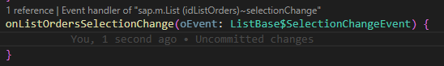

# SAPUI5 Extension


Any support is highly appreciated!<br/>

[](https://www.paypal.com/donate/?hosted_button_id=HPZ5FA8C3KJ6W)
[](https://github.com/sponsors/iljapostnovs)
[](https://donate.cafe/iljapostnovs)

---

[Check the blog to get some ideas for developing with TS!](https://blogs.sap.com/2022/10/28/visual-studio-code-sapui5-extension-now-supports-typescript)

---

This plugin contains perks for UI5 developers.

Before you start working with the plugin, it will be useful to set formatOnSave setting in VSCode preferences:

```json
"editor.formatOnSave": true
```

As well it's recommended to install e.g. Prettier extension for JS/TS files formatting.
The reason for it is described in [Known issues](#known-issues)

Make sure that you have `excludeFolderPattern` property set correctly for `ui5parser`. This property is critical if you have SAPUI5 libraries or any other sources which should not be parsed in your workspace.

---

# v1.7.0 update

Got new XML errors with ids and event handlers? Check out [UI5 Linter Readme](https://github.com/iljapostnovs/ui5plugin-linter/blob/master/README.md#id-and-event-handler-patterns-in-views-and-fragments).

Have any ideas on how to improve [MeaningAssumption](https://github.com/iljapostnovs/ui5plugin-linter/blob/750fe1b40a78151293f64daf0cefe449a56dcba8/src/classes/xml/linters/pattern/AMeaningAssumptionGenerator.ts#L34) variable determination? Create [Feature request](https://github.com/iljapostnovs/VSCodeUI5Plugin/issues/new/choose)

# Summary

-   [Configuration](#configuration)
-   [Completion Items](#completion-items)
-   [Manifest.json schema](#manifestjson)
-   [Method Definitions](#method-definitions)
-   [XML Event Handler Definitions](#xml-event-handler-definitions)
-   [CodeLens](#codelens)
-   [XML Diagnostics](#xml-diagnostics)
-   [JS/TS Diagnostics](#jsts-diagnostics)
-   [Properties (i18n) Diagnostics](#properties-i18n-diagnostics)
-   [Code Action Provider](#code-action-provider)
-   [JS and XML Hover Provider](#js-and-xml-hover-provider)
-   [XML Formatter](#xml-formatter)
-   [JS/TS Rename Provider](#jsts-rename-provider)
-   [Commands](#commands)
    -   [Move sap.ui.define to parameters](#move-sapuidefine-to-parameters)
    -   [Export to i18n](#export-to-i18n)
    -   [Export to i18n (bulk)](#export-to-i18n-bulk)
    -   [Switch View/Controller](#switch-viewcontroller)
    -   [Insert Custom Class name](#insert-custom-class-name)
    -   [Clear Cache](#clear-cache)
    -   [UML Class Diagram generation](#uml-class-diagram-generation)
    -   [JSDoc typedef generation from metadata](#jsdoc-typedef-generation-from-metadata)
    -   [(TS) Generate interfaces for XML files (id to class mapping)](#ts-generate-interfaces-for-xml-files-id-to-class-mapping)
    -   [(TS) Generate interfaces for OData entities](#ts-generate-interfaces-for-odata-entities)
    -   [(TS) Generate interfaces for OData entities (Mass)](#ts-generate-interfaces-for-odata-entities-mass)
    -   [Generate ids for all elements in view or fragment](#generate-ids-for-all-elements-in-view-or-fragment)
-   [Automatic template insertion](#automatic-template-insertion)
-   [Automatic class name and class path renaming](#automatic-class-name-and-class-path-renaming)
-   [UI5 Explorer](#ui5-explorer)
-   [UI5 Project Data](#ui5-project-data)
-   [Hotkeys](#hotkeys)
-   [Proxy](#proxy)
-   [Known issues](#known-issues)
-   [Things to consider using TS](#things-to-consider-using-ts)
-   [Parser instantiation logic](https://github.com/iljapostnovs/ui5plugin-parser/blob/master/README.md#parser-instantiation-logic)
    -   [Additional Workspaces](https://github.com/iljapostnovs/ui5plugin-parser/blob/master/README.md#additional-workspaces)
    -   [Proxy Workspaces](https://github.com/iljapostnovs/ui5plugin-parser/blob/master/README.md#proxy-workspaces)
-   [Extension recommendations](#extension-recommendations)

---

## Configuration

VSCode extension is using [UI5 Parser](https://github.com/iljapostnovs/ui5plugin-parser) and [UI5 Linter](https://github.com/iljapostnovs/ui5plugin-linter) packages, because of that configuration is splitted into three parts:

1. [UI5 Parser configuration](https://github.com/iljapostnovs/ui5plugin-parser/blob/master/README.md#config-default-values). Contains parser related configuration, e.g. UI5 Version, URL for standard library metadata preload, exclude folder patterns etc. Configuration can be done in `package.json` or any of `rc` file types, e.g. `.ui5pluginrc`.

> **Important!** If `ui5parser` related entries were changed in the `package.json` or any other `rc` file, VSCode should be reloaded manually

2. [UI5 Linter configuration](https://github.com/iljapostnovs/ui5plugin-linter/blob/master/README.md#configuration-example). Contains linting related configuration, e.g. linter exceptions, severity, usage etc. Configuration can be done in `package.json` or any of `rc` file types, e.g. `.ui5pluginrc`.
3. VSCode preference entries. Contains VSCode specific configuration.

| VSCode Preference                                       | Description                                                                                                                                                                                                                                                                |
| :------------------------------------------------------ | :------------------------------------------------------------------------------------------------------------------------------------------------------------------------------------------------------------------------------------------------------------------------- |
| ui5.plugin.jsCodeLens                                   | Should javascript CodeLens be enabled                                                                                                                                                                                                                                      |
| ui5.plugin.jsReferenceCodeLens                          | Should javascript Reference CodeLens be enabled                                                                                                                                                                                                                            |
| ui5.plugin.xmlCodeLens                                  | Should xml CodeLens be enabled                                                                                                                                                                                                                                             |
| ui5.plugin.propertiesCodeLens                           | Should properties CodeLens be enabled                                                                                                                                                                                                                                      |
| ui5.plugin.signatureHelp                                | Should UI5 Signature Help be enabled                                                                                                                                                                                                                                       |
| ui5.plugin.moveDefineToFunctionParametersOnAutocomplete | Should sap.ui.define class names be moved to function parameters on sap.ui.define autocomplition                                                                                                                                                                           |
| ui5.plugin.codeGeneratorStrategy                        | Strategy which should be used for code generation. E.g. you will get 'var' with ES5 strategy and 'let' with ES6 strategy when using override completion items.                                                                                                             |
| ui5.plugin.UMLDiagramGenerationStrategy                 | Which format should be used for UML diagram generation                                                                                                                                                                                                                     |
| ui5.plugin.addI18nTextLengthLimitation                  | Should text length be added to i18n text id (e.g. #YMSG,14)                                                                                                                                                                                                                |
| ui5.plugin.textTransformationStrategy                   | Case type which should be used for i18n text id proposal                                                                                                                                                                                                                   |
| ui5.plugin.askUserToConfirmI18nId                       | Should user confirm proposed i18n id                                                                                                                                                                                                                                       |
| ui5.plugin.addInheritedPropertiesAndAggregations        | Should inherited properties/aggregations be added in XML completion items                                                                                                                                                                                                  |
| ui5.plugin.addTagAttributes                             | Should tag attributes be added in XML completion items                                                                                                                                                                                                                     |
| ui5.plugin.addTagAggregations                           | Should tag aggregations be added in XML completion items                                                                                                                                                                                                                   |
| ui5.plugin.tsEventModule                                | Event module for Typescript, which will be used when creating event handler from XML                                                                                                                                                                                       |
| ui5.plugin.tsEventType                                  | Event type for Typescript, which will be used when creating event handler from XML. (e.g. type of `sap/ui/base/Event` is `Event`).                                                                                                                                         |
| ui5.plugin.insertManagedObjectModule                    | Module which will be used for automatic insertion on custom class creation                                                                                                                                                                                                 |
| ui5.plugin.insertControllerModule                       | Module which will be used for automatic insertion on custom controller creation                                                                                                                                                                                            |
| ui5.plugin.xmlFormatterTagEndingNewline                 | Should XML Formatter put tag ending (">", "/>") in newline                                                                                                                                                                                                                 |
| ui5.plugin.xmlFormatterSpaceAfterSelfTagEnd             | Should XML Formatter leave a space between the last attribute and the self tag end ("/>")                                                                                                                                                                                  |
| ui5.plugin.umlGenerationPath                            | Path for file generated by `UI5: Generate UML Class diagram for whole project` command. Relative to project folder. Example: `../diagram/ClassDiagram.pu`                                                                                                                  |
| ui5.plugin.XMLFileInterfacePath                         | Path for file generated by `UI5: (TS) Generate types for XML files (id to class mapping)` command. Relative to project folder. Example: `./types/ViewFragmentIds.d.ts`                                                                                                     |
| ui5.plugin.generateXMLFileInterfacesOnSave              | Should `UI5: (TS) Generate types for XML files (id to class mapping)` command be executed on XML file save or not. Works only if `ui5.plugin.XMLFileInterfacePath` is set. Works only for TS projects.                                                                     |
| ui5.plugin.TSODataInterfacesPath                        | Path for file generated by `UI5: (TS) Generate interfaces for OData entities` command. Relative to project folder. Example: `./types/ODataTypes.d.ts`                                                                                                                      |
| ui5.plugin.TSODataInterfacesFetchingData                | URL, username and password for `UI5: (TS) Generate interfaces for OData entities` command.                                                                                                                                                                                 |
| ui5.plugin.massTSODataInterfacesFetchingData            | Array of URL, username and password for `UI5: (TS) Generate interfaces for OData entities` command (Mass).                                                                                                                                                                 |
| ui5.plugin.ERDiagramPath                                | Path for file generated by `UI5: Generate ER diagram from metadata.xml` command. Relative to project folder. Example: `../diagram/ERDiagram.pu`                                                                                                                            |
| ui5.plugin.JSTypeDefDocPath                             | Path for file generated by `UI5: Generate JS typedef JSDoc from metadata` command. Relative to project folder. Example: `./model/ModelTypedef.js`                                                                                                                          |
| ui5.plugin.globalConfigurationPath                      | Absolute path to global `any_file.json` configuration file, which is used by `UI5 Parser` and `UI5 Linter`. Priority of ui5 config determination: local `package.json` -> global `any_file.json` -> default value. Example: `C:\\Users\\MyUser\\Documents\\ui5config.json` |
| ui5.plugin.idGenerationFormula                          | Formula for id generation.                                                                                                                                                                                                                                                 |
| ui5.plugin.generateIdsCommandData                       | Data for `ui5plugin.generateIds` command. Contains array of classes to be excluded from ID generation and a flag if IDs should be generated for Elements as well, or for Controls only                                                                                     |
| ui5.plugin.bulkExportToi18nCommandData                  | Data for `ui5plugin.bulkExportToi18n` command. Contains data about which proprties should be exported to i18n.only                                                                                                                                                         |

---

## Completion Items

### XML

XML Completion Items for UI5 Controls.<br/>

> Related preference entries:<br/>_ui5.plugin.addInheritedPropertiesAndAggregations_ <br/>_ui5.plugin.addTagAttributes_ <br/>_ui5.plugin.addTagAggregations_ <br/>_ui5.plugin.idGenerationFormula_ <br/>

<br/>
XML Completion Items for properties, aggregations, associations and events<br/>
<br/>

### JS/TS

#### sap.ui.define

Strings for import in `sap.ui.define` are provided.<br/>


#### Control ID Completion Items

IDs from the corresponding view of the controller are provided for view.byId or controller.byId method<br/>


#### Dynamic Completion Items

Completion items which are generated dynamically depending on current variable type or method return value type. Trigger character - dot.<br/>


### Manifest.json

Schema for manifest.json properties is provided.<br/>


---

## Method Definitions

Definitions for custom methods are provided.<br/>

> Hotkey: Ctrl + Left Click<br/>


---

## XML Event Handler Definitions

Definitions for event handlers are provided.<br/>

> Hotkey: Ctrl + Left Click<br/>


---

## CodeLens

CodeLens for Internalization Texts (translations), overriden methods, event handlers and member references is provided


> Related preference entries:<br/> _ui5.plugin.jsCodeLens_<br/> _ui5.plugin.jsReferenceCodeLens_<br/> _ui5.plugin.xmlCodeLens_<br/> _ui5.plugin.propertiesCodeLens_<br/>

---

## XML Diagnostics

See [UI5 Linter](https://www.npmjs.com/package/ui5plugin-linter#xml-linters) for reference<br/>


---

## JS/TS Diagnostics

See [UI5 Linter](https://www.npmjs.com/package/ui5plugin-linter#jsts-linters) for reference<br/>


---

## Properties (i18n) Diagnostics

See [UI5 Linter](https://www.npmjs.com/package/ui5plugin-linter#properties-linters) for reference<br/>

---

## Code Action Provider

Code Actions for UI5 modules import and inserting non-existent methods in `.js`/`.ts` files are provided.<br/>
Code Actions for creating event handlers in controllers from xml views are provided.<br/>

> Hotkey: Alt + Enter<br/>


> **Helpful for TS!** Check out `ui5.plugin.tsEventType` preference entry. Handy if UI5 Version `1.115.1`+ is used, because the preference entry can be changed to `{tsEvent}`, in such case the correct event will be added automatically.
> Example: `ListBase$SelectionChangeEvent` will be generated, if `Create method` action will be selected on non existant event handler in XML view `sap.m.List` -> `selectionChange` event

> 

> 

> Related preference entries: <br/>_ui5.plugin.tsEventModule_<br/>_ui5.plugin.tsEventType_<br/>

---

## JS and XML Hover Provider

Information on hover is provided.<br/>


---

## XML Formatter

XML Formatter is available.<br/>


> Related preference entries: _ui5.plugin.xmlFormatterTagEndingNewline_<br/>_ui5.plugin.xmlFormatterSpaceAfterSelfTagEnd_<br/>

---

## JS/TS Rename Provider

Rename provider for `js`/`ts` is provided.<br/>
The provider renames all references to the class for `JS` projects, and all references for the views/fragments for both `TS`/`JS` projects.<br/>


---

## Commands

---

### Move sap.ui.define to parameters

> Hotkey: F5<br/>

> Related preference entries: _ui5.plugin.moveDefineToFunctionParametersOnAutocomplete_<br/>


---

### Export to i18n

Set your position to the string you want to export to `i18n.properties` file and execute command. Works both in XML and JS files.

> **Info!** If there is no selection, whole string will be exported. If there is a selection, only the selected part of the string will be exported.

> `this.getBundle()` method which returns `ResourceBundle` should be defined in Controller/BaseController

> Related preference entries:<br/> _ui5.plugin.askUserToConfirmI18nId_<br/> _ui5.plugin.addI18nTextLengthLimitation_<br/> _ui5.plugin.textTransformationStrategy_<br/>

> Hotkey: F4<br/>


---

### Export to i18n (bulk)

Open view or fragment and execute command. Works for XML files only.

> **Important!** There is no info provided by SAP regarding which property should be exportable to i18n, that is why it is not possible to fully automate this process. This command exports only properties, which are configured to be exported. If there are some properties which are not exported, but should be, it is possible to adjust `ui5.plugin.bulkExportToi18nCommandData` VSCode preference entry. If you find yourself **editing the preference entry**, please [open a ticket](https://github.com/iljapostnovs/VSCodeUI5Plugin/issues/new?assignees=iljapostnovs&labels=enhancement&projects=&template=feature_request.md&title=Feature+request%3A+) in github and share what was added, so it could be included into default value and work for everyone.

> Related preference entries:<br/> _ui5.plugin.bulkExportToi18nCommandData_<br/>


---

### Switch View/Controller

Goes to view from controller and to controller from view<br/>
If somebody uses `MVC`, the command actually switches between `Model` (Default model, which is set as `this.getView().setModel(oModel)` in the controller) `View` and `Controller`<br/>

> For TS projects it is possible to add `@ui5model` JSDoc to the class, which should have a class name of the model to which the command will switch to. It will improve the performance issue, because reading type of default model might take seconds. Example:

```javascript
/**
 * My Controller JSDoc
 * @ui5model {com.test.mvc.master.model.MyMasterModel}
 */
```

> Hotkey: F3<br/>


---

### Insert Custom Class name

Inserts the class name into current position<br/>

> Hotkey: F6<br/>


---

### Clear Cache

Clears cache with SAPUI5 lib metadata

---

### UML Class Diagram generation

UML Class diagram generates for the project of the currently opened file.<br/>

> Command name: `UI5: Generate UML Class diagram for whole project`

Also it is possible to generate ER diagram for opened `metadata.xml` file.<br/>

> There are two ways to generate ER diagram:<br/>
>
> -   Open `metadata.xml` file, execute command `UI5: Generate ER diagram from metadata.xml`<br/>
> -   Execute command `UI5: Generate ER diagram from metadata.xml` and enter url to `metadata.xml`<br/>

It is possible to select in preferences which type of diagram to generate: DrawIO or PlantUML.<br/>
However, DrawIO is not supported anymore.<br/>

> **Recommended VSCode extensions**:<br/>
> DrawIO: _hediet.vscode-drawio-insiders-build_<br/>
> PlantUML: _jebbs.plantuml_<br/>

> UML Diagram example:<br/> 

> ER Diagram example:<br/> 
> Related preference entries:<br/> _ui5.plugin.umlGenerationPath_<br/>

---

### JSDoc typedef generation from metadata

There is a possibility to generate typedef JSDocs from metadata

There are two ways to generate typedefs:<br/>

-   Open `metadata.xml`file, execute command `UI5: JSDoc typedef generation from metadata`<br/>
-   Execute command `UI5: JSDoc typedef generation from metadata` and enter url to `metadata.xml`<br/>

> Related preference entries:<br/> _ui5.plugin.JSTypeDefDocPath_<br/>

> 

---

### (TS) Generate interfaces for XML files (id to class mapping)

There is a possibility to generate mapping TS interfaces from control id to control type

> Related preference entries:<br/> _ui5.plugin.XMLFileInterfacePath_<br/> _ui5.plugin.generateXMLFileInterfacesOnSave_<br/>


---

### (TS) Generate interfaces for OData entities

There is a possibility to generate TS interfaces for OData entities

There are two ways to generate interfaces:<br/>

-   Open `metadata.xml` file, execute command `UI5: (TS) Generate interfaces for OData entities`<br/>
-   Execute command `UI5: (TS) Generate interfaces for OData entities` and enter url to `metadata.xml`<br/>

> Related preference entries:<br/> _ui5.plugin.TSODataInterfacesPath_<br/> _ui5.plugin.TSODataInterfacesFetchingData_<br/>


---

### (TS) Generate interfaces for OData entities (Mass)

Works the same as previous command, but can be used for multiple OData models at once. `ui5.plugin.massTSODataInterfacesFetchingData` preference entry should be configured for this command to work.

> Related preference entries:<br/> _ui5.plugin.massTSODataInterfacesFetchingData_<br/>

---

### Generate ids for all elements in view or fragment

Command, which generates IDs for elements in views and fragments. To generate ids, open a view or fragment and execute command.


> Related preference entries:<br/> _ui5.plugin.idGenerationFormula_<br/> _ui5.plugin.generateIdsCommandData_<br/>

---

## Automatic template insertion

Inserts initial text for `.js`, `.ts` and `.xml` files<br/>
Extends `"sap/ui/core/mvc/Controller"` if file name ends with `.controller.js`/`.controller.ts` and `"sap/ui/base/ManagedObject"` if file name ends with `.js`/`.ts`<br/>

> **Hint!** `sap/ui/core/mvc/Controller` can be changed to e.g. `com/my/app/BaseController` using `ui5.plugin.insertManagedObjectModule` preference entry

> Related preference entries:<br/> _ui5.plugin.insertControllerModule_<br/> _ui5.plugin.insertManagedObjectModule_<br/> > 

---

## Automatic class name and class path renaming

Extension listens for `.js`/`.ts` file creation event (rename technically is file deletion and creation) and replaces all occurrences of class name to the new one<br/>


---

## UI5 Explorer

Custom `UI5 Explorer` view in VSCode panel is available<br/>

1. For JS/TS files tree view contains fields and methods<br/>
   

    > Coloring for methods is based on lines count and references count.<br/> > **Red** color appears if there are more than 100 lines in one method<br/> > **Orange** color appears if there are more than 50 lines in one method or there are 0 references (reference count is ignored if method is overriden)<br/> > **Green** color appears for the rest of the cases

2. For XML files tree view contains class tag list<br/>
   

---

## UI5 Project Data

Custom `UI5 Project Data` view in VSCode panel is available

It represents the data about the project, like UI5 Version, config path etc. It makes easier to troubleshoot the config related issues.

View is not updated automatically, in order to do that, refresh button on the top right corner should be pressed.


---

## Hotkeys

|   Hotkey    | Command                                  |
| :---------: | ---------------------------------------- |
| Alt + Enter | Quick Fix Action                         |
|     F3      | Switch View/Controller                   |
|     F4      | Export string to i18n                    |
|     F5      | Move sap.ui.define imports to parameters |
|     F6      | Insert custom class name                 |

---

### Assumptions

-   File starts with sap.ui.define (JS)
-   Your class body is in AnyUI5Class.extend("name", {_here_}); (JS)<br/>
-   You have manifest.json with App ID
-   App ID (Component name) and i18n paths are defined in manifest.json
-   File is without syntax errors
-   Name of the UI5Class is written accordingly to file path. (E.g. "/src/control/Text.js" => "anycomponentname.control.Text")
-   You have an access to https://ui5.sap.com for standard lib metadata preload

---

### Proxy

If HTTP_PROXY or HTTPS_PROXY environment variables are set, https://ui5.sap.com will be requested using the proxy.

---

# Known issues

## acorn-loose

acorn-loose is used as JS parser. It has issues if you have mixed spaces and tabs.
Example:

```javascript
function() {
	 var oModel = this.getModel();
	var asd;
}
```

There is an unnecessary space before `var oModel` and acorn is parsing it incorrectly.
As a result - the file will not be parsed as expected and you might not get JS completion items and get errors in xml views regarding wrong values for event handlers.<br/>
Keep your code clean, it will help you to have the plugin working correctly :)<br/>
It's highly recommended to set formatting on save in your VS Code preferences, it will help to avoid such issues.

```json
"editor.formatOnSave": true
```

Standard VSCode JS Formatter is not handling all formatting issues. `hookyqr.beautify` extension did, but it got deprecated. It's highly recommended to install some kind of formatter, e.g. Prettier, and use as JS formatter.

```json
"[javascript]": {
	"editor.defaultFormatter": "<YourFormatter>"
}
```

---

## ui5.sap.com damaged JSON response

For some reason `ui5.sap.com` sometimes might return damaged JSON when requesting standard library metadata. As a result, it is possible to get such error as:<br/>
<br/>
To solve it, please run `UI5: Clear cache` command and reload VSCode.

---

## Things to consider using TS

1. If any `.ts` files are found and `tsconfig.json` is found, project is considered to be TS project
2. `src-gen` folder is automatically excluded by extension if it's TS project. If build folder has different name, it should be added to folder exclusions in [UI5 Parser configuration](https://github.com/iljapostnovs/ui5plugin-parser/blob/master/README.md#config-default-values).
3. Folder with builded resources should be added to exclusions of `ui5parser`. Check `excludeFolderPatterns` in package.json.
4. Not all linters work for TS, because TS has a lot out of the box features. E.g. Wrong field/method linter works only for JS, because TS has it's own syntax analysis for that.
5. `ts-morph` is used as TS parser and it has some drawbacks. When using typechecker to get type e.g. of the field or return type of the method, `ts-morph` might hang up for about ~10s, which is not great. However, types are crucial for Reference CodeLens/Linters, specifically for fields in order to be able to distinguish them in views/fragments. As a workaround for performance issues, typechecker is not used to get field types. Because of that only simple structure is allowed.

Examples which should work as expected:

```typescript
export default class Random {
  formatterInstance = new Formatter(),
  formatterObject = Formatter
}
```

At the same time type detection will work if the type is specifically written, e.g.

```typescript
formatter: Formatter = ...
```

6. Disabling TS standard reference code lens should be considered. This extension contains its own reference code lens, which includes references to views and fragments.

---

# Extension recommendations

-   [ESLint](https://marketplace.visualstudio.com/items?itemName=dbaeumer.vscode-eslint) for additional linting
-   [Live Share](https://marketplace.visualstudio.com/items?itemName=MS-vsliveshare.vsliveshare) for live code sharing with colleagues
-   [PlantUML](https://marketplace.visualstudio.com/items?itemName=jebbs.plantuml) for viewing diagrams generated by SAPUI5 Extension
-   [Prettier](https://marketplace.visualstudio.com/items?itemName=esbenp.prettier-vscode) for pretty code
-   [TODO Highlight](https://marketplace.visualstudio.com/items?itemName=wayou.vscode-todo-highlight) to not forget about your TODOs
-   [Template String Converter](https://marketplace.visualstudio.com/items?itemName=meganrogge.template-string-converter) to be even more lazy
-   [Version Lens](https://marketplace.visualstudio.com/items?itemName=pflannery.vscode-versionlens) for updating your tooling
-   [YAML](https://marketplace.visualstudio.com/items?itemName=redhat.vscode-yaml) to get autocomplete for `ui5.yaml` and `.ui5pluginrc.yaml` with this preference entry:

```json
"yaml.schemas": {
    "https://raw.githubusercontent.com/iljapostnovs/VSCodeUI5Plugin/master/schema/packageSchema.json": [
        ".ui5pluginrc.yaml",
        ".ui5pluginrc.yml"
    ]
}
```

-   [XML](https://marketplace.visualstudio.com/items?itemName=redhat.vscode-xml) to get simple syntax linting
